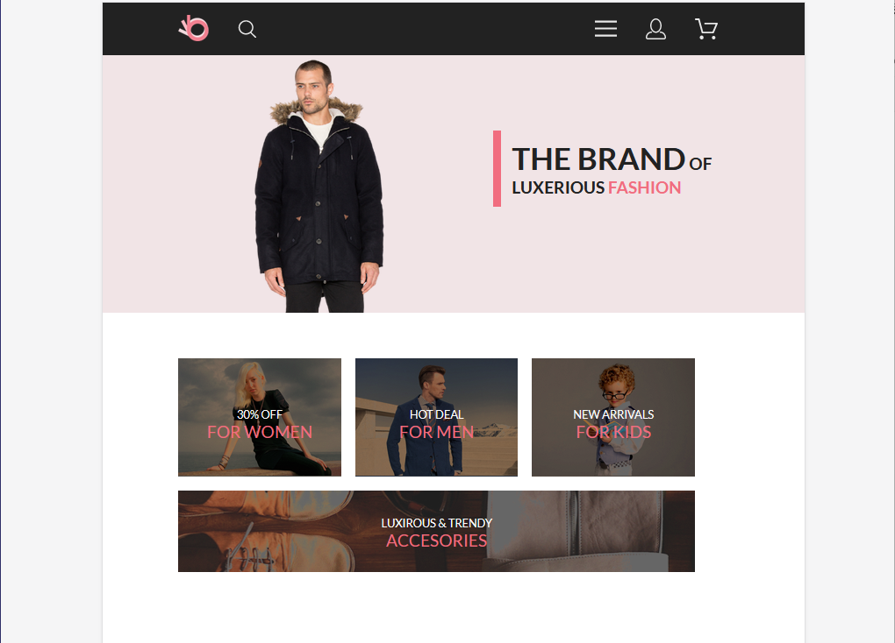
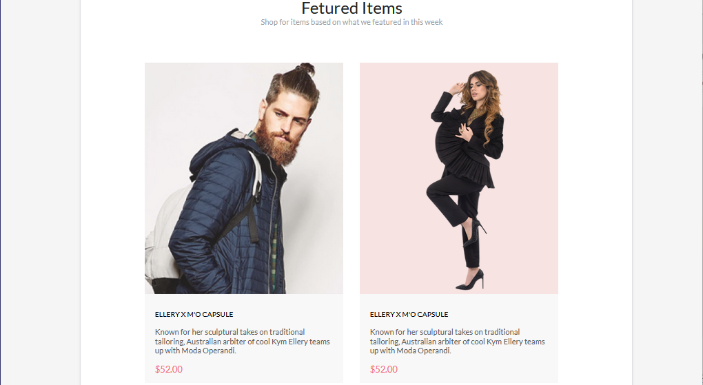
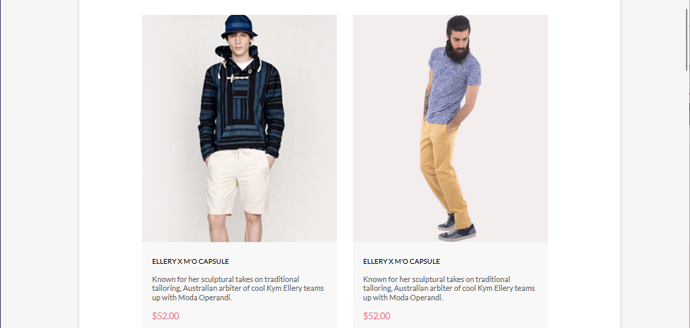
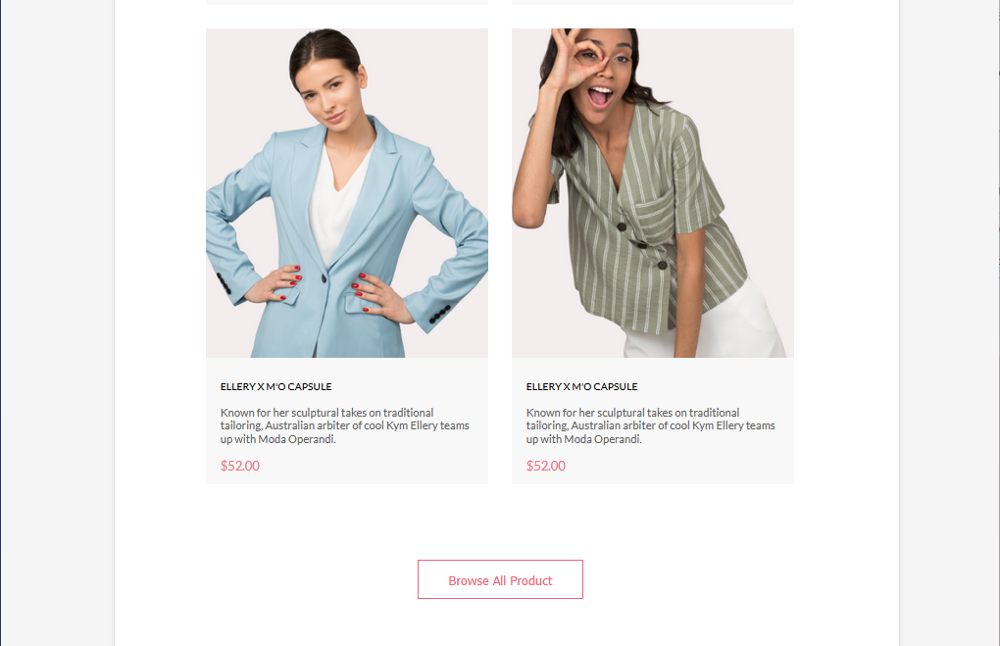
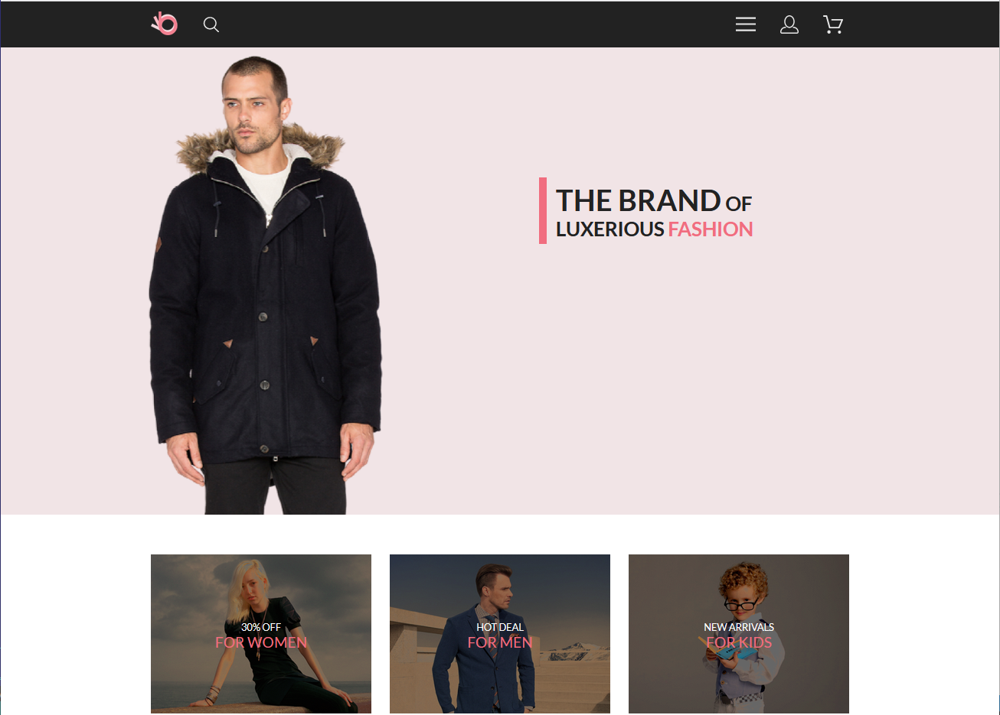
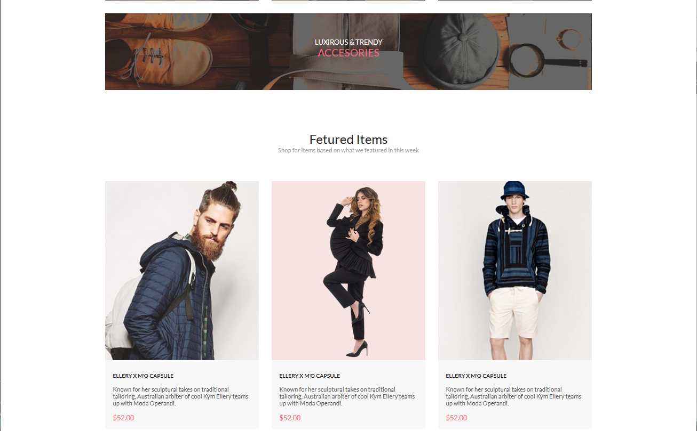
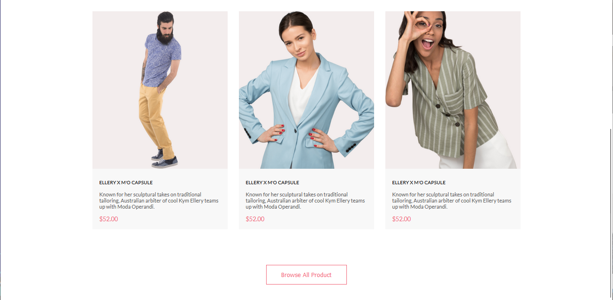

# Основы веб-верстки HTML/CSS
## Урок 12. Семинар. Основы создания адаптивного сайта

### Задание:

Макет [https://www.figma.com/file/mnLY69cYE5cqWM5w6n5hXx/Seo-%26-Digital-Marketing-Landing-Page?node-id=188%3A2](https://www.figma.com/file/mnLY69cYE5cqWM5w6n5hXx/Seo-%26-Digital-Marketing-Landing-Page?node-id=188%3A2)

В данном уроке мы переходим к созданию планшетной версии проекта.

1. Создать медиа запрос, чтобы наш проект отлично смотрелся на разрешениях экрана 768-1024.
2. Создать планшетную версию проекта.
3. Мобильную версию сайта создавать не нужно. 

### Решение

Решение представлено в текущей папке. Корневой файл - [index.html](index.html)

### Результат работы:

#### Адаптивная верстка под планшет:

#### Адаптивная верстка под десктоп:

